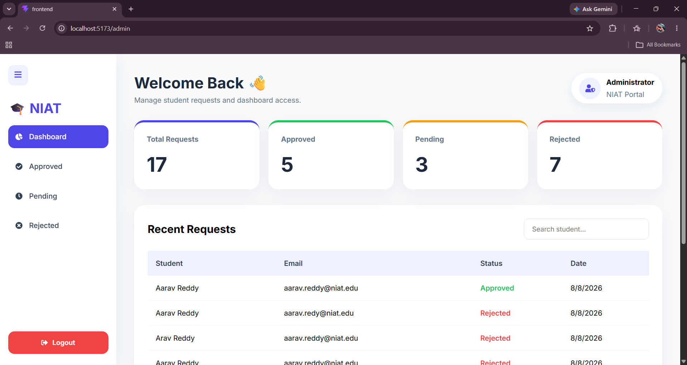
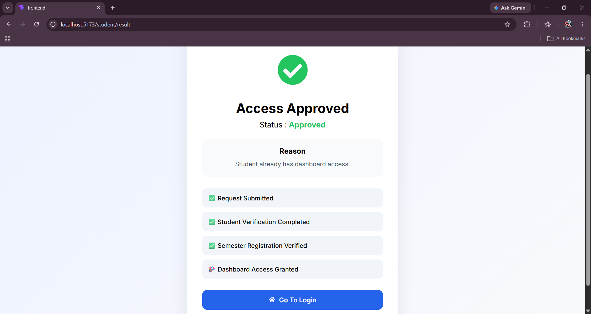
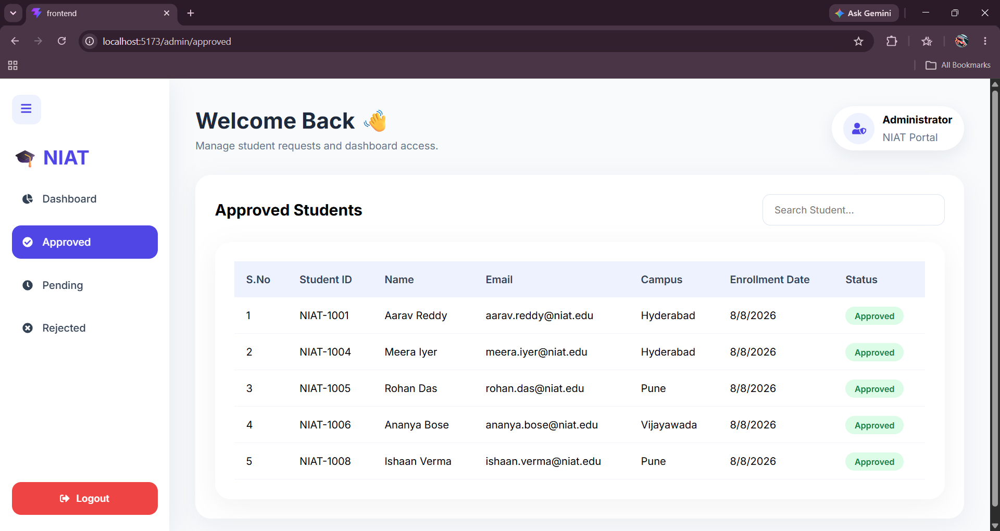
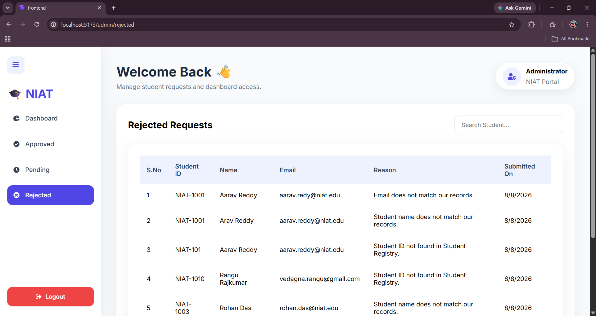
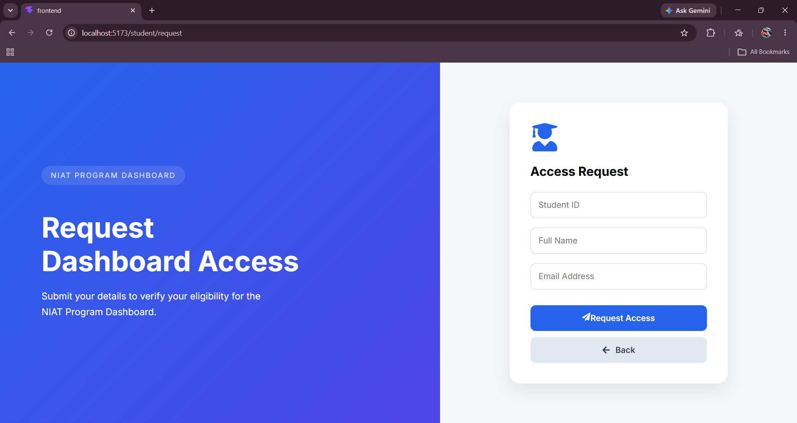
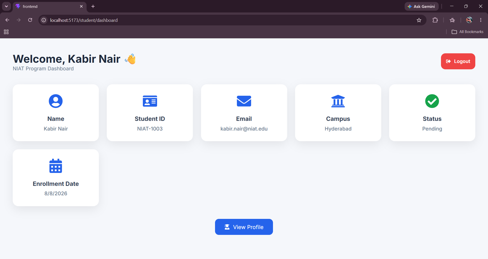
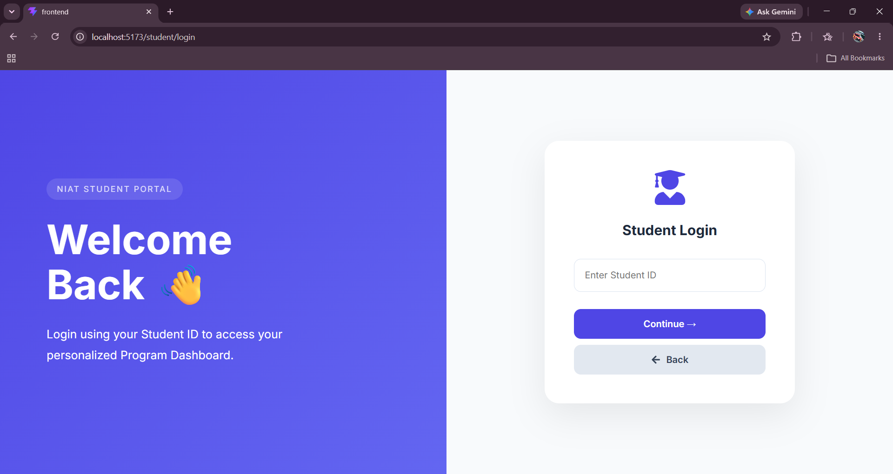
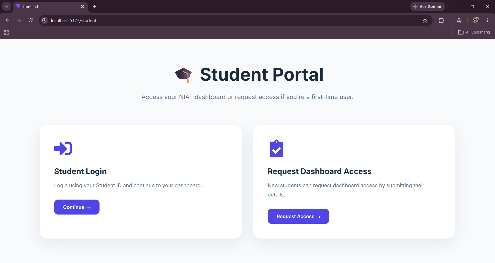
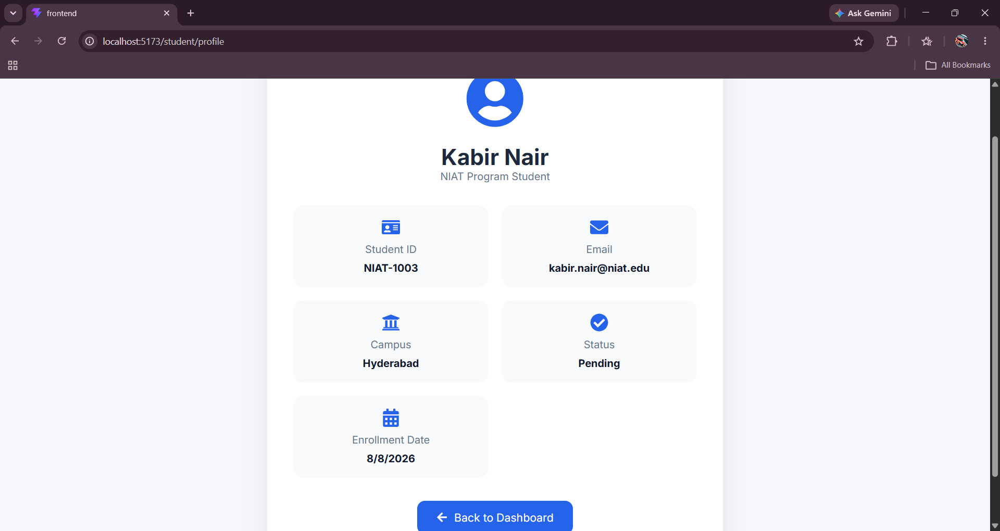

# 🚀 NIAT Dashboard Access Portal

A full-stack web application built to streamline the student access request and approval process for the NIAT Dashboard. The system allows students to request access, while administrators can review, approve, or reject requests through a centralized dashboard.

---

## 📌 Features

### 👨‍🎓 Student Portal
- Student Login
- Request Dashboard Access
- View Application Status
- Student Dashboard
- Profile Management
- Result Page

### 👨‍💼 Admin Portal
- Admin Dashboard
- View Pending Requests
- Approve Student Requests
- Reject Student Requests
- View Approved Students
- Dashboard Statistics

---

## 🛠️ Tech Stack

### Frontend
- React.js
- Vite
- JavaScript
- CSS3

### Backend
- Node.js
- Express.js

### Database
- MySQL

### Tools
- Git
- GitHub
- VS Code
- Postman

---

## 📂 Project Structure

```
niat-program-dashboard
│
├── backend
│   ├── routes
│   ├── services
│   ├── server.js
│   └── package.json
│
├── frontend
│   ├── public
│   ├── src
│   │   ├── components
│   │   ├── pages
│   │   ├── services
│   │   └── styles
│   └── package.json
│
└── README.md
```
---

## Screenshots

### Admin Dashboard


### Approval Card


### Approved Students


### Pending Students


### Rejected Requests


### Request Dashboard


### Student Login Dashboard


### Student Login


### Student Portal


### Student Profile



---

## ⚙️ Installation

### Clone the repository

```bash
git clone https://github.com/Vedagna999/NIAT-Dashboard-Access-Portal.git
```

### Navigate to the project

```bash
cd NIAT-Dashboard-Access-Portal
```

---

## Backend Setup

```bash
cd backend
npm install
npm start
```

Backend runs on

```
http://localhost:5000
```

---

## Frontend Setup

Open another terminal

```bash
cd frontend
npm install
npm run dev
```

Frontend runs on

```
http://localhost:5173
```

---

## Workflow

1. Student logs into the portal.
2. Student submits an access request.
3. Request is stored in the database.
4. Admin reviews pending requests.
5. Admin approves or rejects the request.
6. Student can view the updated request status.

---

## Future Improvements

- JWT Authentication
- Email Notifications
- Role-Based Access Control
- Search & Filter
- Pagination
- Dashboard Analytics
- Export Reports
- Activity Logs

---


## Author

**Vedagna R**

GitHub:
https://github.com/Vedagna999

---

## License

This project is developed for learning and demonstration purposes.
